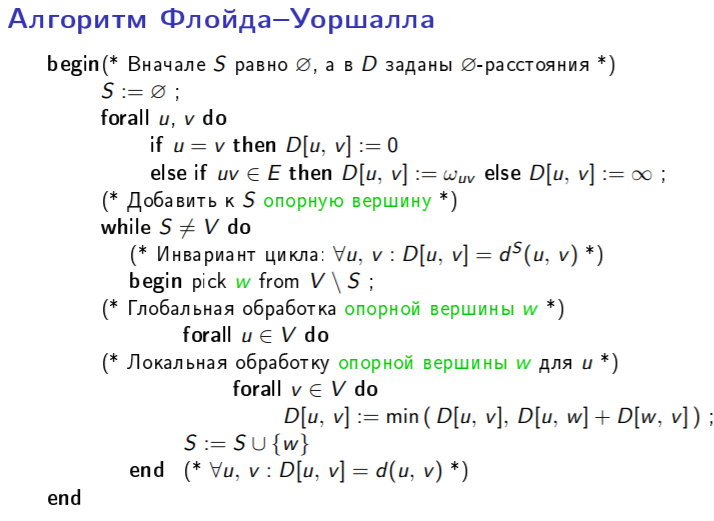

# 21. Задача маршрутизации. Алгоритм Флойда-Уоршалла построения кратчайших путей в графе. Алгоритм маршрутизации Туэга: описание алгоритма, обоснование его корректностии оценка сложности по числу обменов сообщениями.[1, стр. 113-128]

**Маршрутизация** - это процедура принятия решения о том, какому соседу (иногда не единственному) следует передать пакет, чтобы он в конце концов был доставлен по назначению.

Цель, которая ставится при проектировании алгоритма маршрутизации, состоит в том, чтобы снабдить каждый узел процедурой, которая сможет выполнять эту функцию и гарантировать доставку каждого пакета по назначению. Для этого на каждом узле доожна храниться некоторая информация о топологии сети. Эта информация предоставляется в виде **таблицы маршрутизации**.

Задача маршрутизации:

- Вычисление таблиц. Таблицы маршрутизации должны быть вычислены при инициализации сети и должны обновляться при изменении топологии сети.
- Продвижение пакета. Когда пакет пересылается по сети, то его передвижение осуществляется на основе таблиц маршрутизации.

Критерии оценки качества методов маршрутизации учитывают след. показатели:

- Корректность
- Эффективность
- Сложность
- Устойчивость
- Адаптивность
- Справедливость

Существует несколько вариантов понятия *лучший путь*:

- минимальное количество звеньев
- минимальная стоимость
- минимальная задержка

Выбор маршрута обычно проводится только с учетом узла-адресата.

### Алгоритм Флойда-Уоршалла

Алгоритм нахождения длин кратчайших путей между всеми парами вершин во взвешенном ориентированном графе. Работает корректно, если в графе нет циклов отрицательной величины. Алгоритм работает за $O(n^3)$ времени.

Предположим, что имеется взвешенный граф $G = (V, E)$, в котором каждому ребру $uv$ приписан вес ω~uv~. Мы будем считать, что в графе отсутствуют циклы отрицательного веса. **Вес пути**  $<u_0, ..., u_k>$  -  это число, равное $\sum_{i=0}^{k-1}w_{u_i}w_{u_{i+1}}$ . **Расстояние** между вершинами $u$ и $v$ - это наименьший вес $d(u, v)$ пути, соединяющего вершины $u$ и $v$ (если таких путей нет, то $d(u, v) = ∞ $). Задача построения кратчайших путей для всех пар вершин состоит в том, чтобы вычислить расстояние $d(u, v)$ для каждой пары вершин $u$ и $v$.

Для вычисления всех расстояний в алгоритме Флойда-Уоршалла используется понятие S-путей, в которых все промежуточные вершины принадлежат подмножеству S множества вершин V . **Определение S-расстояния** Пусть S  некоторое подмножество множества вершин V . Путь $<u_0, ..., u_k>$  называется S-путем, если $u_i ∈ S$ для каждого $i, 0 < i < k$. S-расстоянием между вершинами $u$ и $v$, которое обозначается $d^S (u, v)$ , называется наименьший вес S-пути между $u$ и $v$ (если таких путей нет, то  $d^S (u, v)  = ∞ $). Работа алгоритма начинается с построения всех ∅-путей, а затем множество S -путей наращивается для все более обширных подмножеств S , до тех пор пока не будут рассмотрены все V-пути.

**Теорема 5.2. (об S-путях)** *(думаю, не обязательно писать в билете)* Для всех вершин $u$ и подмножеств S выполняется равенство $d^S (u, u)= 0$. Если $u \not= v$ , то S-пути подчиняются следующим правилам. 

1. ∅-путь из вершины $u$ в вершину $v$ существует в том и только том случае, когда $uv ∈ E$. 
2. Если $uv ∈ E $, то $d^∅(u, v) = ω_{uv}$ ; иначе $d^∅(u, v) = ∞$. 
3. Если  $S^` = S ∪ \{w\}$, то простой $S^`$-путь из $u$ в $v$ - это либо S-путь из $u$ в $v$ , либо соединение двух S-путей, один из которых ведет из $u$ в $w$, а другой из $w$ в $v$. 
4. Если $S^` = S ∪ \{w\}$, то $d^{S^`} (u, v) = min( d^S (u, v), d^S (u, w) + d^S (w, v) )$ . 
5. Вершины $u$ и $v$ соединены путем в том и только том случае, когда между вершинами $u$ и $v$ существует V-путь. 
6. $d(u, v) = d^V (u, v)$ 

**Алгоритм**: Вначале множество S - пустое. Потом на каждом шаге алгоритма берем новую вершину из V. Для всех пар вершин из V пересчитываем расстояния d. Новая вершина добавляется в S. Так пока S не равно V.

**Код:**

### Алгоритм маршрутизации Туэга

В основу алгоритма Туэга (Toueg) положен алгоритм Флойда-Уоршалла.

Допущения:

1. Каждый цикл имеет положительный вес
2. Каждый процесс сети располагает информацией об отличительных признаках всех узлов системы (множества вершин V)
3. Каждый процесс знает, кто его соседи (для каждой вершины $u$ эти сведения содержатся в массиве $neigh_u$) и вес соединяющих их каналов

Переменные и операции алгоритма Флойда-Уоршалла разносятся по разным узлам сети. Переменная $D[u, v]$ отдается процессу $u$; для удобства обозначения мы будем записывать $u$ на месте индекса следующим образом $D_u[v]$ . Операции, которые присваивают значения переменной $D_u[v]$ должны выполняться в узле $u$, и когда значение некоторой переменной, относящейся к узлу $w$, необходимо для этой операции, это значение должно быть послано процессу $u$. В алгоритме Флойда-Уоршалла все вершины должны использовать информацию от опорной вершины, которая отправляет эту информацию одновременно всем вершинам посредством широковещательной рассылки . Нужно ввести специальную операцию, для того чтобы не только вычислять длины кратчайших S-путей, но также и первый канал в каждом таком пути (для этого мы будем использовать переменные $Nb_u[v]$).

**Лемма 5.3. (об отсутствии циклов)** 

Пусть заданы множество вершин S и вершина w . Предположим также, что 

1. для всех вершин $u$ верно равенство $D_u[w] = d^S (u, w)$ , 
2. если $d^S (u, w) < ∞$ и $u \not= w$ , то значением переменной $Nb_u[w]$ является имя соседа вершины $u$ на кратчайшем S-пути, ведущем к вершине $w$. 

Тогда ориентированный граф $T_w = (V_w , E_w )$, где $V_w = \{u : D_u[w] < ∞\}$ и $E_w = \{ux : u \not= w ∧ Nb_u[w] = x\}$, является деревом, в корне которого расположена вершина $w$.

Туэг заметил, что если $D_u[w] = ∞$ в начале этапа обработки опорной вершины $w$, то по окончании этого этапа таблица маршрутизации узла $u$ не изменяется, т.к. неравенство $D_u[w] + D_w [v] < D_u[v]$ неверно для каждой вершины $v$. Поэтому таблицу маршрутизации $D_w$ нужно доставить только в те узлы, которые принадлежат дереву $T_w$ (в том виде, в котором оно построено к началу этапа обработки опорной вершины), и широковещательную рассылку можно провести эффективно, отправляя таблицу $D_w$ только по тем каналам, которые входят в состав дерева $T_w$ . Узел $w$ отправляет таблицу $D_w$ своим сыновним вершинам в дереве $T_w$, и каждый узел в дереве $T_w$, получив эту таблицу от родительской вершины в дереве $T_w$, передает ее своим сыновним вершинам в дереве $T_w$.

В начале этапа обработки опорной вершины $w$ каждый узел $u$, для которого $D_u[w] < ∞$, знает, какая вершина является его родителем в дереве $T_w$, но не знает, какие вершины являются его сыновьями. Поэтому каждый узел $v$ должен отправить сообщение каждому своему соседу $u$, сообщив процессу $u$, является ли $v$ сыновней вершиной для $u$ в дереве $T_w$. Любой узел может принять участие в распространении таблицы опорной вершины $w$, как только он получит известия о том, какие из соседей являются его сыновними вершинами в дереве $T_w$.

В алгоритме используются сообщения трех типов: 

1. Сообщения $<ys,w>$ (ys от your son) отправляется от узла $u$ к узлу $x$ в начале этапа обработки опорной вершины $w$ , если $x$ является родительской вершиной для $u$ в дереве $T_w$. 
2. Сообщение $<nys,w>$ (nys от not your son) отправляется от узла $u$ к узлу $x$ в начале этапа обработки опорной вершины $w$, если $x$ не является родительской вершиной для $u$ в дереве $T_w$. 
3. Сообщение $<dtab,w, D>$ отправляется по ходу обработки опорной вершины $w$ по каждому ребру дерева $T_w$, чтобы доставить таблицу $_Dw$ в каждую вершину, которая должна будет воспользоваться этим значением.

Пусть $W$  число битов для записи веса пути. 

**Теорема 5.5. (корректности и сложности алгоритма Туэга)** Для каждой пары вершин $u$ и $v$ алгоритм Туэга вычисляет расстояние между $u$ и $v$. Если это расстояние конечно, то он также определяет первый канал в кратчайшем пути. По ходу работы алгоритма по каждому каналу проходит $O(N)$ сообщений, $O(N^2W)$ битов информации. Таким образом, суммарно по ходу работы алгоритма передается $O(N · |E|)$ сообщений и $O(N^3 · W)$ битов информации. Кроме того в каждом узле используется память, объем которой составляет $O(N · W )$ битов.

*Доказательство* На каждом этапе обработки опорной вершины $w$ по каждому каналу связи проходят два сообщения вида $<ys,w>$ или $<nys,w>$ (по одному сообщению в каждом направлении) и не более одного сообщения вида $<dtab,w, D>$, и значит по каждому каналу проходит не более 3N сообщений. Сообщения вида $<ys,w>$ или $<nys,w>$  содержат $O(W)$ битов, а сообщение вида $<dtab,w, D>$ содержит $O(NW)$ битов, и отсюда следует верхняя оценка битовой сложности обмена информацией по каждому каналу связи. За время работы алгоритма передается не более $N^2$ сообщений вида $<dtab,w, D>$ и $2N · |E|$ сообщений вида $<ys,w>$ и $<nys,w>$ ; таким образом всего по сети передается $O(N^2 · NW + 2N · |E| · W ) = O(N^3W)$ битов информации. Для хранения таблиц $D_u$ и $Nb_u$ каждому процессу $u$ требуется $O(NW)$ битов памяти.

Завершаемость и частичная корректность алгоритма следуют из корректности алгоритма Флойда-Уоршалла. Отсюда следует и справедливость утверждения о  том, что значением переменной $Nb_u[v]$ является наименование первого канала в кратчайшем пути из $u$ в $v$ или $Nb_u[v] = udef$, поскольку значение $Nb_u[v]$ изменяется всякий раз, когда переменной $D_u[v]$ присваивается новое значение.

(На самом деле для доказания корректности в презентациях вводится еще и упрощенный алгоритм Туэга, но это уже совсем долго)

(Не обязательно)

**Достоинства**:

- Прост, имеет небольшую сложность, и строит оптимальные маршруты.

**Недостатки:**

- Плохая устойчивость («робастость»): при изменении топологии сети все вычисления нужно проводить заново.
- Согласованный выбор очередной опорной вершины (w) всеми узлами сети предполагает, что множество участвующих в алгоритме процессов заранее известно.
- В алгоритме Туэга часто применяется неравенство треугольника $d(u, v) < d(u, w) + d(w, v)$. 
  Для вычисления правой части этого неравенства (в узле $u$) требуется «глобальная» информация о $d(w, v)$, которой не обладает ни процесс $u$, ни его соседи. Зависимость от удаленных данных вынуждает нас организовать доставку этой информации удаленным вершинам.

