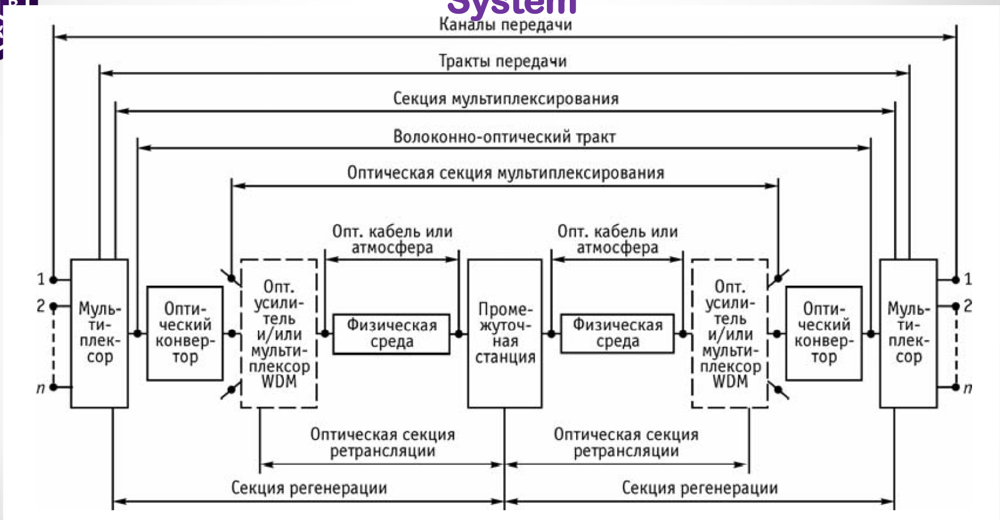
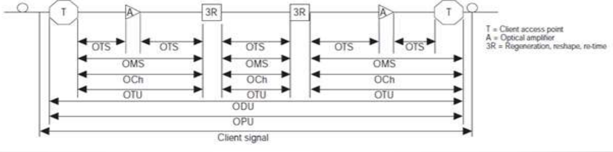
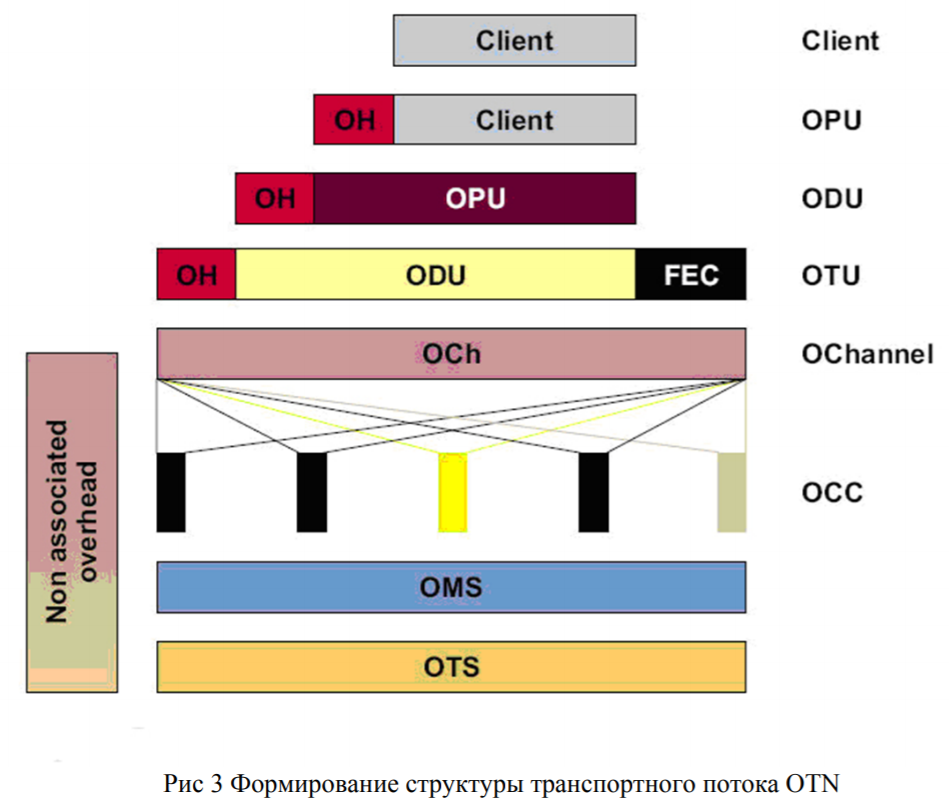
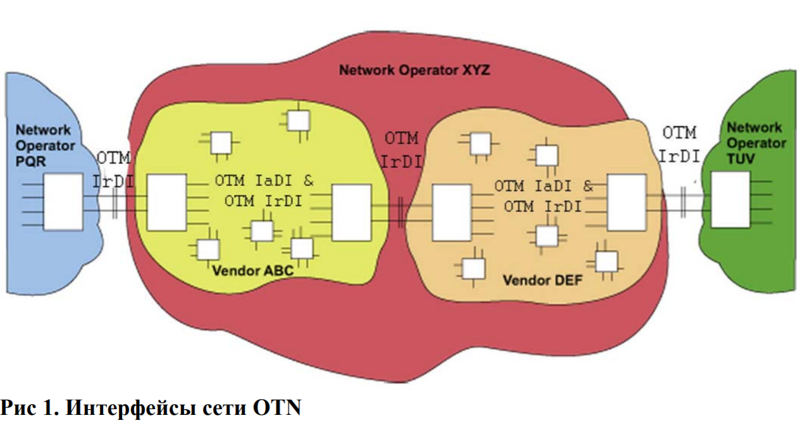
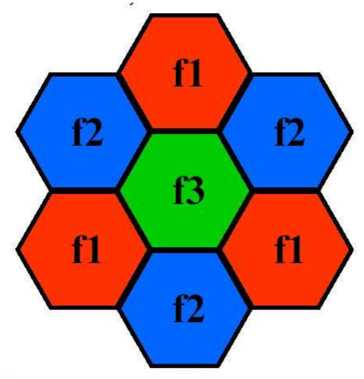

# 3. Основные принципы организации оптических и беспроводных систем передачи данных.

### Оптические системы

**Волоко́нно-опти́ческая связь** — способ передачи информации, использующий в качестве носителя информационного сигнала электромагнитное излучение оптического (ближнего инфракрасного) диапазона, а в качестве направляющих систем — волоконно-оптические кабели. Благодаря высокой несущей частоте и широким возможностям мультиплексирования пропускная способность волоконно-оптических линий многократно превышает пропускную способность всех других систем связи и может измеряться Терабитами в секунду. Малое затухание света в оптическом волокне позволяет применять волоконно-оптическую связь на значительных расстояниях без использования усилителей. Волоконно-оптическая связь свободна от электромагнитных помех и труднодоступна для несанкционированного использования: незаметно перехватить сигнал, передаваемый по оптическому кабелю, технически крайне сложно.

*Рисунок 1: Общая схема построения оптических систем.*

**OTN** — основная технология построения магистральных волоконно-оптических сетей связи на сегодняшний день, сменившая SDH/SONET (Synchronous Optical NETwork). Аббревиатура OTN расшифровывается как Optical Transport Network («оптическая транспортная сеть»). OTN — это оптическая транспортная сеть, которая обеспечивает передачу и мультиплексирование цифровых данных по волновым каналам DWDM (Dense Wavelength Division Multiplexing, плотное мультиплексирование с разделением по длине волны, обеспечивает передачу по волокну оптических сигналов на разных длинах волн). Технология OTN стандартизирована сектором телекоммуникаций Международного союза электросвязи (ITU-T) в декабре 2009 года, см. «ITU-T Recommendation G.709 «Interfaces for the Optical Transport Network (OTN)»».

**Принцип действия** технологии OTN заключается в том, что сигналы различных форматов упаковываются в стандартные контейнеры, которые затем передаются по волоконно-оптической сети. Таким образом, обеспечивается возможность передачи по транспортной сети любых необходимых типов клиентских сигналов (STM, ATM, IP, Fibre Channel, InfiniBand и др.), а также эффективное использование пропускной способности за счет плотной упаковки разнородного трафика.

В заголовки контейнеров может добавляться служебная информация, которая позволяет контролировать прохождение трафика по сети и обнаруживать ошибки работы, а также избыточное кодирование, которое позволяет восстанавливать повреждённый трафик без необходимости его повторной передачи. Технология коррекции ошибок FEC, применяемая в сетях OTN, позволяет успешно восстанавливать переданный сигнал даже после существенных искажений и затуханий, что даёт возможность строить оптоволоконные магистрали OTN протяжённостью сотни и тысячи километров. 

**Структура контейнера OTN**

Контейнер OTN строится путём добавления к исходным клиентским данным нескольких заголовков, каждый из которых выполняет свою функцию. 

- Во-первых, клиентский трафик разбивается на части нужного размера, после чего к каждой из них добавляется заголовок, описывающий тип трафика. Получившийся блок информации называется **OPU** — Optical Payload Unit, «оптический блок нагрузки». В данном блоке описывается используется ли мультиплексирование и его параметры. Также данный может передавать сигнал для синхронизации. Блок OPU передаётся в неизменном виде из конца в конец сети — т.е. от точки приёма клиентских данных до точки выдачи этих данных клиенту (между конечными (де)мультиплексаторами оптического сигнала). 
- Во-вторых, к блоку OPU добавляется служебная информация, необходимая для мониторинга прохождения сигнала по сети и управления процессом передачи сигнала. Получившийся блок информации называется **ODU** — Optical Data Unit, «оптический блок данных». Блок ODU также передаётся в неизменном виде из конца в конец сети — т.е. от точки приёма клиентских данных до точки выдачи этих данных клиенту.
- В-третьих, к блоку ODU добавляется избыточное кодирование (**FEC**, Forward Error Correction) и дополнительная служебная информация — для мониторинга, контроля и восстановления трафика на отдельном сегменте сети между двумя транспондерами. Получившийся блок информации называется **OTU** — Optical Transport Unit, «оптический транспортный блок». Блок OTU передаётся в неизменном виде в пределах участка сети, ограниченного транспондерами (т.е. пунктами, где сигнал преобразуется в электронный вид для [3R-регенерации](https://ru.wikipedia.org/wiki/Оптический_регенератор)). Таким образом, протокол OTU работает между соседними узлами сети OTN, которые поддерживают функции электрической регенерации оптического сигнала, называемые также функциями 3R(retiming, reshaping and regeneration).

Таким образом, по сети OTN передаются контейнеры OTU, каждый из которых представляет собой «матрёшку», где под несколькими слоями служебных данных скрывается исходный клиентский сигнал. Можно сказать, что клиентский сигнал «завёрнут» в несколько слоёв служебных данных — поэтому технологию OTN называют также «digital wrapper technology», или «optical channel wrapper» (англ. wrapper – обёртка).

G.709 определяет 6 уровней OTN потока

- OPU

- ODU

- OTU

- OCh: Optical Channel. Представляет собой end-to-end оптический путь. Передается на несущей определенного "цвета".

- OMS: Optical Multiplex Section. Секция мультиплексирования. Работает между OADMs (Optical Add Drop Multiplexer). Используется для мониторинга оптического соединения и обнаружения проблем в OTN.

- OTS: Optical Transport Section. Секция передачи. Работает в пределах участка сети, ограниченного двумя сетевыми элементами. Выполняет задачи контроля и обслуживания сети между сетевыми элементами (мультиплексоры, демультиплексоры, оптические коммутаторы и тд.). 

  Первые три - electrical domain, вторые три - optical domain.

**FEC**

В процедуре прямой коррекции ошибок (FEC) используются коды Рида-Соломона RS(255, 239). В этом самокорректирующемся коде данные кодируются блоками по 255 байт, из которых 239 байт являются пользовательскими, а 16 байт представляют собой корректирующий код. Коды Рида-Соломона позволяют исправлять до 8 ошибочных байтов в блоке из 255 байт.
Применение кода Рида-Соломона позволяет улучшить отношение мощности сигнала к мощности шума на 5дБ при уменьшении уровня битовых ошибок с 10−3(без применения FEC) до 10−2(после применения FEC). Этот эффект дает возможность увеличить расстояние между генераторами сети на 20 км или использовать менее мощные передатчики сигнала.

**Интерфейсы**

В рекомендации ITU-T G.872 описаны два типа интерфейсов для OTN: IrDI (Inter-Domain Interface) и IaDI (Intra-Domain Interface). Внешний интерфейс IrDI встречается при присоединении сети одного оператора к сети другого оператора, на внутренних стыках различных подсетей одного оператора и на стыках однотипного оборудования внутри одной подсети. Внутренний интерфейс IaDI встречается только на стыках однотипного оборудования одной подсети. 

[Подробно про структуру заголовков OTN можно прочитать тут](https://asvk.cs.msu.su/~bahmurov/course_advanced_networks/2018//%D0%A7%D1%82%D0%BE%20%D1%82%D0%B0%D0%BA%D0%BE%D0%B5%20OTN.PDF)

### Беспроводные системы

**Беспроводная вычислительная сеть** — вычислительная сеть, основанная на беспроводном (без использования кабельной проводки) принципе, полностью соответствующая стандартам для обычных проводных сетей (например, Ethernet). В качестве носителя информации в таких сетях могут выступать радиоволны СВЧ-диапазона.

**ALOHAnet** — первая компьютерная сеть передачи данных с пакетной коммутацией, использовавшая в качестве среды доступа к ней беспроводную технологию. Была разработана и введена в эксплуатацию в 1968-1970-х годах группой учёных Гавайского университета под руководством Нормана Абрамсона в рамках исследовательского проекта THE ALOHA SYSTEM, основной целью которого было изучение возможностей использования радиопередачи как альтернативы проводным коммуникациям. В чистой ALOHA вещание, как и в радио, может начаться в любой момент, все устройства слушают и передают на одной частоте, следовательно могут возникать коллизии. 

Поэтому придумали **Carrier Sense Multiple Access With Collision Avoidance** (**CSMA/CA**, множественный доступ с контролем несущей и избеганием коллизий) — это сетевой протокол, в котором выделяются фазы:

1. **Carrier Sense**: перед передачей станция слушает канал, определяя свободен ли он (могут быть скрытые станции)
2. **Collision Avoidance**: если мы услышали, что кто-то передает — мы спим время (часто случайное), затем слушаем снова, если свободно — передаем.
   - RTS/CTS — могут опционально использоваться для уменьшения негативного эффекта скрытых станций. Явный запрос на передачу (RTS). Передача не начнется пока станция не получит разрешение (CTS) от получателя.
   - Передача данных: так как отправителю сложно обнаруживать коллизии во время передачи, часто используется схема с явным подтверждением передачи кадра (ACK). Если ACK не получен, то производятся повторные попытки (возможно с экспоненциальным backoff-ом).

Беспроводные сети делятся на два типа: локальные (WLAN) и мобильные сотовые сети.

Примеры WLAN: WiFi, WiMAX (сейчас практически нигде не используется)

Сотовые сети: AMPS, GSM, CDMA2000, LTE, etc

**Технологии, использующиеся в беспроводных сетях для увеличения скорости:**

- MIMO
- OFDM (orthogonal frequency division multiplexing)
- OFDMA
- Увеличение ширины канала
- Новые СКК

  - QAM 16, QAM 64, QAM 256, QAM 1024
  - QAM 4096 (думают делать или нет)
  - Номер соответствует количеству значений одного символа (на одной несущей)
    - 64 => 6 бит (можно закодировать)
    - 1024 => 10 бит
  - Упирается в формулу Шеннона
  - Каждый раз нужен в 2 раза меньший SNR
- Агрегирование
- Блочное подтверждение

**Сотовая связь** — один из видов мобильной радиосвязи, в основе которого лежит сотовая сеть. Зона покрытия сети делится на ячейки (соты), определяющиеся зонами покрытия отдельных базовых станций. Основной идеей, на которой базируется принцип сотовой связи, является повторное использование частот в несмежных сотах. Каждая из ячеек обслуживается своим передатчиком с невысокой выходной мощностью и ограниченным числом каналов связи. Это позволяет без помех использовать повторно частоты каналов этого передатчика в другой, удаленной на значительное расстояние, ячейке. Это хорошо иллюстрируется раскраской сот, использующих один диапазон частот, в одинаковый цвет и сот, использующих разные диапазоны, в разные цвета. Таким образом сеть делится минимум на 3 кластера. 

**Основные принципы сотовых сетей**

- Использование лицензируемого спектра радиочастот (в России выделяется ГКРЧ): для сетей 4G диапазон 900 MГц – 3500 MГц 
- Централизованное управление: все передачи пользовательских устройств управляются сетью (базовыми станциями) 

**Wi-Fi** — технология беспроводной локальной сети с устройствами на основе стандартов IEEE 802.11. Работает в диапазоне 2.4 ГГц и 5 ГГц. В 802.11ay - 60 ГГц (миллиметровый WiFi). Может работать по двум схемам: с точкой доступа и в режиме ad-hoc. Основной протокол для доступа к среде передачи данных — DCF. DCF использует метод CSMA/CA вместе с алгоритмом двоичной экспоненциальной отсрочки.

**DCF**

Пока канал занят, станция ничего не передает. После освобождения канала станция ждёт дополнительно интервал времени *DIFS*. В сетях с большим числом станций передача нескольких станций сразу по окончании интервала DIFS может привести к коллизиям, поэтому каждая станция генерирует счётчиком отсрочки (англ. backoff). backoff — это случайное число в интервале (0, CWmin], где CWmin - это конкурентное окно (англ. contention window). Станция слушает канал время $\sigma$, определённое в стандарте как время пустого слота, и, если канал был свободен, уменьшает счётчик отсрочки на единицу. Если канал был занят, то станция замораживает свой счётчик отсрочки и ждёт пока канал освободится, далее ждёт интервал DIFS и размораживает счётчик отсрочки. Когда счётчик отсрочки достигает нуля, станция передаёт кадр данных.

DCF включает в себя необходимость подтверждения успешного приёма кадра данных, таким образом если станция после отправки своего кадра не получила кадр подтверждения (англ. acknowledgment, ACK), она считает передачу неуспешной.

Если передача была неуспешной (из-за коллизии станций или помех), станция вновь генерирует backoff из интервала (0, 2CWmin]. Конкурентное окно увеличивается вдвое каждый раз после неудачной попытки передачи кадра данных пока не достигнет значения CWmax. Если конкурентное окно достигло максимума, станция его не меняет до тех пор пока не будет достигнут предел количества попыток передач (англ. retry limit) кадра данных.

По достижении предельного числа попыток передач кадра данных станция сбрасывает кадр данных и начинает пытаться передавать следующий кадр данных из очереди FIFO. Если это был *первый* сброшенный кадр данных, станция сбрасывает конкурентное окно до значения (0, CWmin] и вновь его экспоненциально наращивает. Если же станция сбросила два кадра данных подряд, то все последующие кадры данных передаются на максимальном конкурентном окне до тех пор, пока хотя бы один кадр данных не будет передан успешно. Если кадр данных был передан успешно, то для следующего кадра данных используется минимальное конкурентное окно (0, CWmin].

Дополнительно станции могут использовать механизм RTS/CTS, который заключается в предварительной отправке кадров Request-to-Send (англ. Запрос на передачу) передающей станцией и Clear-to-Send (англ. Разрешение передачи) принимающей станцией. Кадр RTS короткий, и попадание в коллизию двух кадров RTS менее болезненно, чем попадание в коллизию двух длинных кадров данных. Если кадр данных слишком короткий, использование RTS/CTS может быть неэффективно — в таком случае используется RTS порог (англ. RTS Threshold), который определяет максимальную длину кадра данных, который будет передан без использования механизма RTS/CTS. В кадрах RTS/CTS дополнительно устанавливается TXOP (англ. transmission opportunity, рус. возможность передачи) — интервал виртуальной занятости канала, в течение которого другие станции должны воздерживаться от начала своей передачи. RTS/CTS позволяет частично (но не полностью) решить проблемы скрытых и засвеченных станций.

