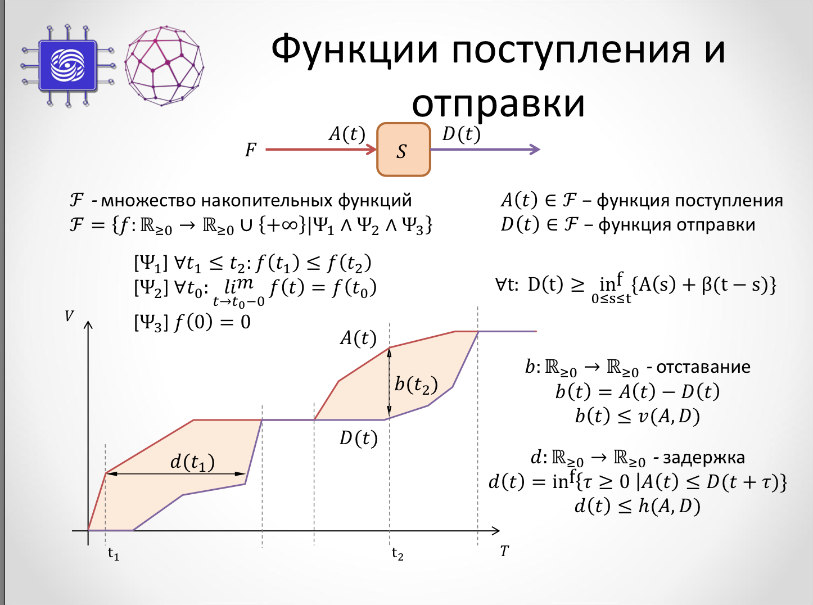
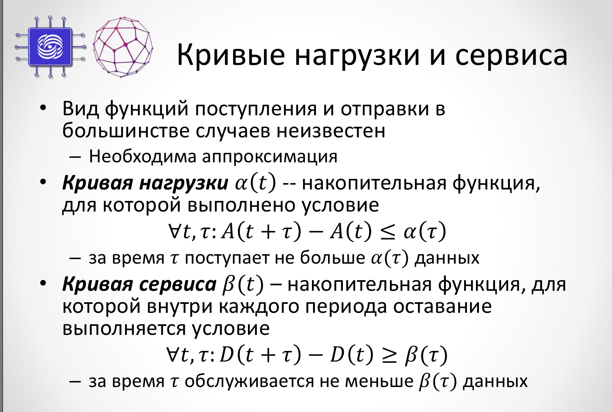
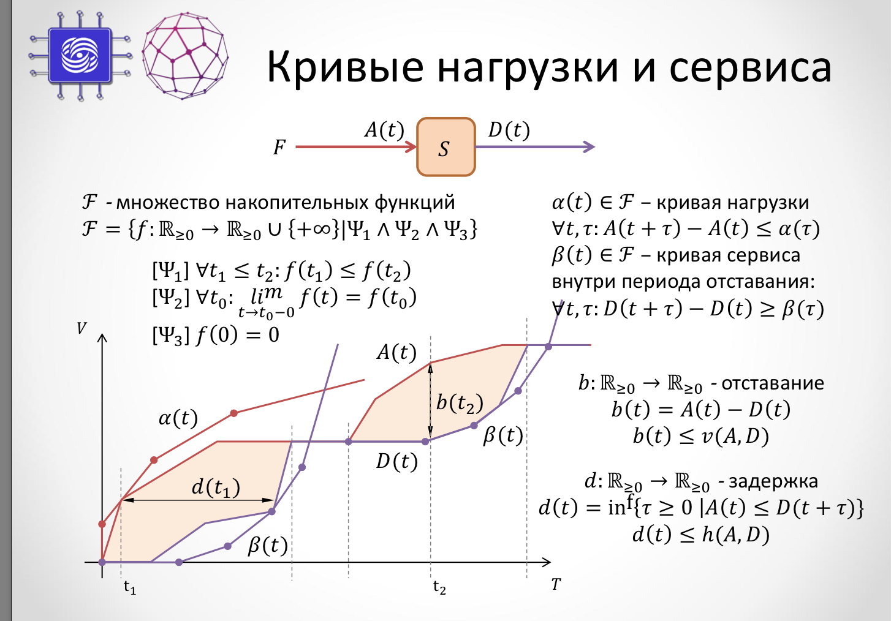
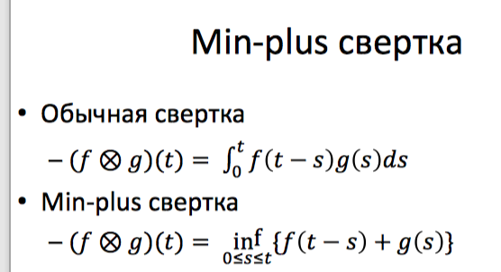
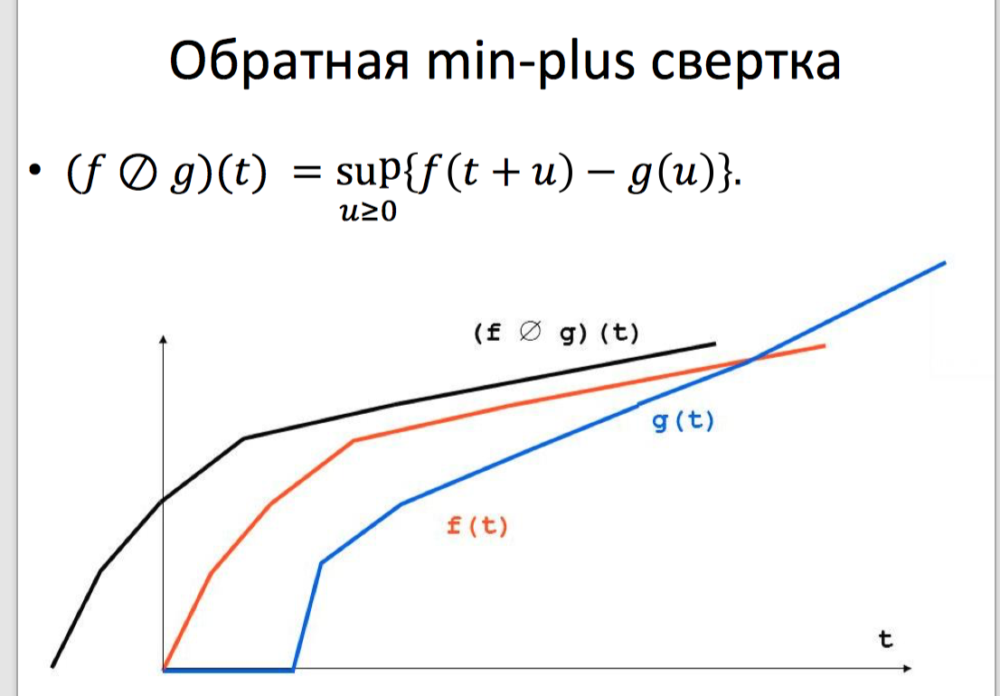
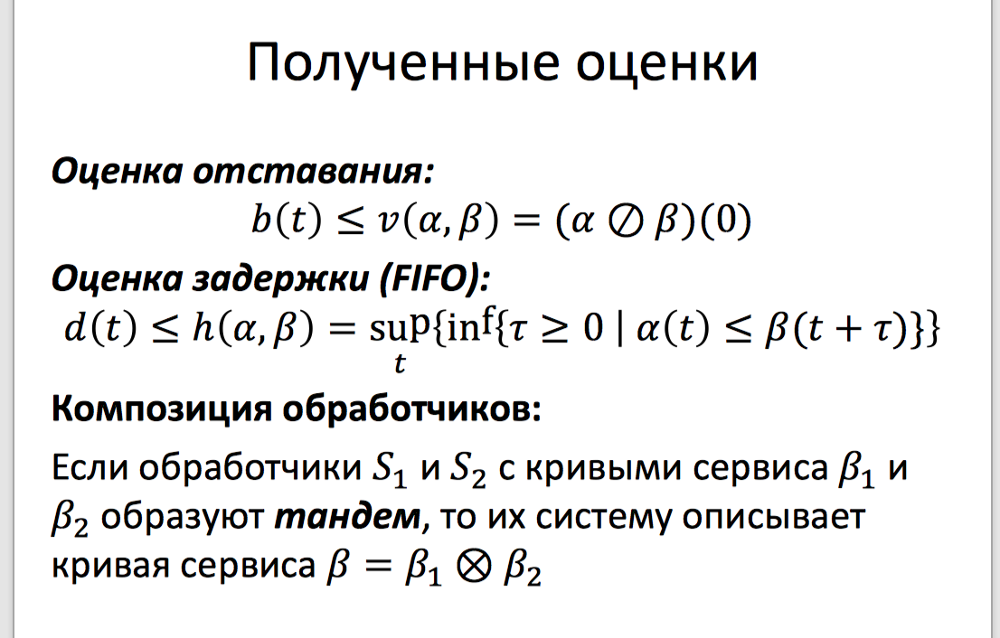

# 9. Основные подходы математического моделирования КС. Прототипирование КС: преимущества, недостатки, ограничения применимости.

## Методы моделирования

Модель — сущность/объект, который отображает процессы, протекающие в реальных системах с помощью математических или натурных средств. Отражение процессов осуществляется на основе оценки характеристик (зависимостей) или параметров процессов моделируемых систем.
Основные условия выбора метода моделирования:

* Постановка задачи
* Составом, характером и объемом исходных данных
* Временем на решение исследовательской задачи

Методы моделирования:

* Натурное или физическое
* Аналитическое
* Имитационное
* Комбинированные методы

**Натурное моделирование**
Измерение характеристик осуществляется на исследуемых системах в реальном времени (проведение экспериментов). Данные исследователь получает ведя наблюдение за процессами в реальной системе.

Достоинства:

* Высокая адекватность модели реальной системе
* Высокая точность результатов

Недостатки:

* Высокая стоимость создания модели
* Большие временные затраты
* Необходимость доработки отдельных узлов реальной системы для проведения натурных экспериментов

**Аналитическое моделирование**
Модель представляется совокупностью аналитических выражений, которые отражают функциональные зависимости между параметрами реальной системы в процессе ее работы. Аналитические модели применяются для относительно простых систем, для исследования характеристик которых не требуется высокая точность.

Достоинства

* Простота и низкая стоимость модели
* Возможность быстро получить численные результаты

Недостатки

* Большое число допущений и ограничений
* Невысокая точность результатов
* Соответствие результатов определенным условиям
* Большая сложность аналитического описания функциональных зависимостей

**Имитационное моделирование**
Метод исследования, при котором изучаемая система заменяется моделью с достаточной точностью описывающей реальную систему и с ней проводятся эксперименты с целью получения информации об этой системе. Экспериментирование с моделью называют имитацией (имитация — это постижение сути явления, не прибегая к экспериментам на реальном объекте). Это метод математического моделирования. Существует класс объектов, для которых по различным причинам не разработаны аналитические модели или аналитические методы решения полученной модели. В таких случаях математическая модель заменяется имитационной.
Достоинства:

* Высокая адекватность между физической сущностью описываемого процесса и его моделью
* Возможность описать сложную систему на достаточно высоком уровне детализации
* Значительно больший охват исследования, чем у аналитического моделирования
* Отсутствие ограничений на зависимости между параметрами модели
* Возможность оценки функционирования системы не только в стационарных состояниях, но и в переходных процессах (режимах)
* Получение большого числа данных об исследуемом объекте
* Наиболее рациональное отношение “результат-затраты” по отношению к аналитическому и физическому моделированию

Недостатки

* Относительно большая сложность создания модели
* Необходимость высокой квалификации исследователя для написания модели
* Необходимость проведения верификации и валидации данных моделирования
* Индивидуальность реализации. Для широкого применения модели необходимо сделать детальное описание ее построения

**Комбинированные методы**
Модель представляется как комбинация методов моделирования. Наиболее широко применяются имитационно-аналитические модели. Степень применения методов моделирования определяет исследователь, исходя из поставленных задач, имеющихся ресурсов и времени на проведение исследовательской работы.

## Основные подходы математического моделирования КС

### Детерминированное сетевое исчисление

Сетевое исчисление (Network Calculus) — это совокупность математических результатов, которые позволяют исследовать граничные значения характеристик функционирования таких сложных технических систем, как сети связи, цифровые электрические цепи, конкурирующие программы.

Представление в виде сети обработчиков:

- Обработчик — логически целостный компонент, выполняющий преобразования потоков данных

Описание обработчиков:

- Характеристики производительности — Принципы мультиплексирования

Описание нагрузки — множества потоков данных, поступающих в систему:

- Маршрут передачи данных
- Характеристики интенсивности

Накопительная функция — зависимость количества переданных данных от времени (ясно, что монотонно неубывает).

#### Основные определения

- Функция прибытия $A(t)$ описывает зависимость суммарного количества данных, поступивших на обработчик от времени

- Функция отправки $D(t)$ — зависимость количества переданных данных потока от времени
- Каждый обработчик может быть описан перечислением пар вида $<A(t), D(t)>$
- Отставание(backlog) $b(t)$ — выражает количество данных, находящихся внутри обработчика
- Период отставания — промежуток в течение которого функция отставания строго положительна
- Задержка (delay) $d(t)$ — время прохождения через обработчик той порции данных, которая поступила на него в момент времени $t$.

Кривые нагрузки определяются профилями трафика после shaping’а & policing’a.

Сетевое исчисление основано на использовании функций (кривых) входящего и исходящего трафика, а также функций обслуживания в сетевых узлах. Эти функции могут быть получены с использованием свёртки в min-плюс алгебре.

#### Результаты

#### Применение Network Calculus

- Separated Flow Analysis

- Линейное программирование

### Стохастическое сетевое исчисление

Идея: позволить нарушения кривых нагрузки и сервиса с некоторой вероятностью, следовательно теряем точность результата.

Принципы:

- Задать распределение для поступающего трафика и обслуживания обработчиков
- Получить афинную оценку
- Связать афинную оценку с погрешностью оценки
- Сохраняем подходы из детерминированного сетевого исчисления

## Прототипирование

Прототипирование КС — это моделирование КС с помощью “почти реальных” виртуальных машин/контейнеров и тд. В таком случае мы строим сеть из полноценных сетевых устройств, пусть даже с некоторым уровнем абстракции. Это может быть как ручками построенная сеть из виртуальных машин или контейнеров (lxc, docker), так и mininet/maxinet.

### Linux LXC Контейнеры

LXC используют Cgroups для изоляции ресурсов. Cgroups - это механизмы виртуализации и изоляции, которые поддерживаются ядром Linux начиная с версии 2.6.24. Cgroups позволяют обеспечить сетевыми интерфейсами, таблицами маршрутизации и ARP-таблицами процессы в рамках одной операционной системы. Это один из видов виртуализации на уровне ОС, позволяющий запустить множество однотипных процессов в изолированном и ограниченном по ресурсам окружении. 

Используемые операции с сетевым пространством имен: 

1. Создание сетевого пространства имен 
2. Ассоциирование интерфейса с сетевым пространством имен 
3. Конфигурирование интерфейса в сетевом пространстве имен

### Mininet

Техники, подобные Cgroups, позволяют Mininet создавать в пространстве ядра или пользователя коммутаторы, OpenFlow-контроллеры и хосты, и взаимодействовать в рамках моделируемой сети. В качестве виртуальных коммутаторов используется адаптированная реализация OpenvSwitch’a.Основная функциональность Mininet реализована на Python, за исключением некоторых утилит написанных на Си. Практически любая произвольная топология может быть описана с помощью специального синтаксиса на Python. В интернете можно найти множество интересных лабораторных работ на базе mininet, решающих различные задачи. Например реализация простого маршрутизатора.

### Docker

Докер — это открытая платформа для разработки, доставки и эксплуатации приложений. Позволяет отделить ваше приложение от вашей инфраструктуры. Позволяет запускать практически любое приложение безопасно изолированное в контейнере.

Что использует:

* Пространство имен (namespaces)
* Control groups (контрольные группы)
* Union File System

*(Дальше придумывала сама, добавляйте свои пункты,если есть идеи)*

Преимущества

* Высокий уровень детализации модели без использования физических устройств
* Легкость создания модели

Недостатки

* Сложность моделирования больших сетей (вроде по оценкам Антоненко mininet может создать ~1000 хостов максимум)
* Можно исследовать только те характеристики, которые есть в используемых абстракциях сетевых устройств

